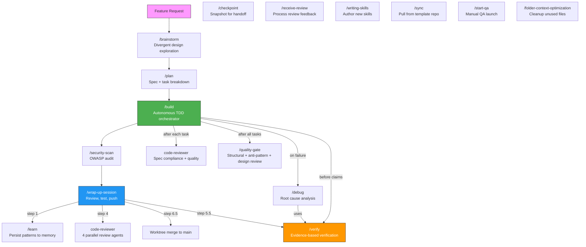

# Coding Agent Workflow

A reusable, project-agnostic configuration system that enforces **spec-driven, TDD-first development** across all your projects — with persistent memory, specialized agents, and a structured session lifecycle. Works with Claude Code, Codex, Pi, Cursor, and other AI coding tools.

---

## What's Included

| Layer | What it does |
|-------|-------------|
| **CLAUDE.md** | Core rules: Spec → Plan → TDD workflow, Clean Code, SOLID, quality gate |
| **Skills** (`.claude/skills/`) | Cross-harness workflows for planning, building, verification, review, learning, synchronization, and project-specific verification recipes |
| **Agents** (`.claude/agents/`) | 8 specialized subagents for planning, coding, review, debugging, security |
| **Hooks** (`.claude/hooks/`) | Session start orientation + auto test runner on file save |
| **Learning store** (`tasks/solutions/`) | Typed per-document learnings, grep-first retrieval, written via `/learn` |

Codex uses the same canonical `.agents/` sources through the explicit adapter
`bash scripts/install-codex.sh`; no Codex-specific project rules are required.

## Codex Setup

From the workflow repository, install the shared user-level configuration:

```bash
git clone <this-repo-url> ~/coding-agent-workflow
cd ~/coding-agent-workflow
bash scripts/install-codex.sh
```

The adapter installs skills in `~/.agents/skills/`, renders shared rules into
`~/.codex/AGENTS.md`, converts canonical Markdown agents into
`~/.codex/agents/*.toml`, and merges optional lifecycle hooks into
`~/.codex/hooks.json`. Existing personal content is preserved and rerunning the
command is idempotent. Review the hook commands with Codex's `/hooks` command
before enabling them.

For a non-default Codex directory, set `CODEX_HOME` before running the script.
For an existing project, copy `project-template/AGENTS.md` alongside the
existing project scaffold files. New `git init` repositories receive the
neutral `AGENTS.md` seed automatically after the regular installer has set up
the git template directory.

Update all installed workflow artifacts with:

```bash
cd ~/coding-agent-workflow
git pull
bash scripts/install-codex.sh
```

---

## Using This as Your Default for Every Project

Run `install.sh` once. It sets up three layers of enforcement that activate automatically for every future project.

### Step 1 — Clone and install

```bash
git clone <this-repo-url> ~/coding-agent-workflow
cd ~/coding-agent-workflow
bash install.sh
```

Then paste the printed `newproject()` function into your `~/.bashrc` or `~/.zshrc`:

```bash
source ~/.bashrc   # or source ~/.zshrc
```

### Step 2 — Start every new project with

```bash
newproject my-app
cd my-app
claude
```

That's it. Claude is fully oriented from the first message.

---

## What `install.sh` Does

### Layer 1 — Global Claude config (`~/.claude/`)

Copies your skills, agents, and CLAUDE.md into `~/.claude/`. Claude Code reads this directory for **every session in every project** — no per-project setup needed.

```
~/.claude/
├── CLAUDE.md          ← global rules (applies everywhere)
├── skills/            ← all skills available in every project
├── agents/            ← all agents available in every project
├── hooks/
│   └── session-start.sh
└── settings.json      ← registers the SessionStart hook globally
```

The **SessionStart hook** runs automatically at the start of every Claude Code session. It prints:
- Learning-store counts from `tasks/solutions/` (documents + needs_review)
- Pending and in-progress tasks from `tasks/todo.md`
- Current git branch and uncommitted change count

### Layer 2 — Git template directory (`~/.git-templates/`)

Sets `git config --global init.templateDir ~/.git-templates`. Every time you run `git init`, a `post-init` hook fires and copies this scaffold into the new repo (only if files don't already exist):

```
tasks/todo.md            ← active task plan
tasks/solutions/         ← typed learning store (schema in its README.md)
tasks/history.md         ← session narrative log
tasks/concepts.md        ← concept glossary (swept once by /memory-maintain, then accreted)
specs/                   ← feature specification directory
CLAUDE.md               ← Claude project-specific overrides
AGENTS.md               ← harness-neutral project-specific overrides
```

### Layer 3 — `newproject` shell function

```bash
newproject() {
  local name="${1:?Usage: newproject <project-name>}"
  mkdir -p "$name" && cd "$name"
  git init                        # triggers post-init hook → copies agent scaffold
  echo "# $name" > README.md
  git add . && git commit -m "chore: init project with coding-agent scaffold"
}
```

Wraps `git init` (which triggers layer 2) and makes an initial commit. One command from zero to a scaffolded project that can be opened with Claude, Codex, Pi, or another supported harness.

### Optional — graphify code graph

`graphify` builds a queryable code graph so the agent can traverse a repo instead of grepping it. It is entirely optional — everything above works without it.

The split matters: **the CLI installs once per machine, the graph is per project and per clone.**

```bash
pip install graphify        # once per machine

# inside each project (per clone — none of this is shared)
graphify update .           # build/refresh graphify-out/graph.json
graphify claude install     # CLAUDE.md section + PreToolUse hook
graphify hook install       # re-index on commit/checkout
```

`install.sh` runs the per-project wiring for you when the `graphify` CLI is on your `PATH`, and skips it silently when it isn't.

---

## Keeping It Up to Date

Re-running `install.sh` is safe — it overwrites `~/.claude/` with the latest version:

```bash
cd ~/coding-agent-workflow
git pull
bash install.sh
```

---

## Adding to an Existing Project

No need to use `newproject`. Just copy the scaffold files manually:

```bash
cp ~/coding-agent-workflow/project-template/tasks/todo.md tasks/
cp -r ~/coding-agent-workflow/project-template/tasks/solutions tasks/
cp ~/coding-agent-workflow/project-template/tasks/history.md tasks/
cp ~/coding-agent-workflow/project-template/tasks/concepts.md tasks/
cp ~/coding-agent-workflow/project-template/CLAUDE.md .
cp ~/coding-agent-workflow/project-template/AGENTS.md .
mkdir -p specs
```

Then edit `CLAUDE.md` to fill in your project's stack and test commands.

---

## Session Workflow

```
Feature Request
    │
    ▼
/brainstorm ──► explore options → multi-option proposals → design approval
    │
    ▼
/plan ──► interviews you → writes spec → task list in tasks/todo.md
    │
    ▼  (confirm with 'y')
/build ──► autonomous TDD + sub-agents → 2-stage review → quality-gate → spec validation
    │
    ▼  (all tasks done)
/security-scan ──► audit changed files for OWASP issues
    │
    ▼
/wrap-up-session ──► verify → code review → sync learnings → merge worktree → push
```

---

## Skill Interdependency



**Core workflow** (top row): brainstorm → plan → build → security-scan → wrap-up-session

**Internal calls**: /build delegates to sub-agents for TDD, invokes code-reviewer for 2-stage review, /debug on failures, /quality-gate after all tasks, and /verify before any completion claims.

Project verification maps use a two-speed update path. `/build` and
`/wrap-up-session` invoke `/maintain-verification-skill --scope changed` before
E2E checks for user-facing session changes. Invoke
`/maintain-verification-skill` without that option for a full audit of every
mapped feature.

**Standalone skills** (bottom): Can be invoked independently at any time.

---

## Skills

Invoke with `/skill-name` in any Claude Code session:

| Skill | What It Does |
|-------|-------------|
| `/prd` | Greenfield project interview → PRD + backlog + context file |
| `/brainstorm` | Divergent design exploration: 2-3 approaches with trade-offs, design approval before `/plan` |
| `/plan` | Interviews you, writes spec to `specs/`, creates TDD task plan in `tasks/todo.md` |
| `/build` | Autonomous orchestrator: TDD + sub-agents + 2-stage review + parallel dispatch + quality-gate + spec validation |
| `/auto-push` | One approval gate at `/plan`, then `/build` + `/wrap-up-session` run autonomously through commit and push |
| `/yolo` | Ralph-style full-auto loop: `/plan` (auto-confirmed) → `/build` → `/wrap-up-session`, iterating until backlog empty or circuit breaker |
| `/auto-improve` | Unattended discover→fix loop: survey backlog/tech-debt/tests/perf/design, ship one high-value improvement as a PR |
| `/debug` | Root cause analysis with architecture questioning after 3 fails, bug-track store documents |
| `/verify` | Evidence-based verification gate — no completion claims without fresh command output |
| `/create-verification-skill` | Discover an app's real user surface, generate its `verify-<app>` recipe and feature map, then prove one feature live |
| `/maintain-verification-skill` | Reconcile changed user behavior with `--scope changed`, or run a full audit of the complete feature map |
| `/quality-gate` | 3-phase post-build review: structural quality, AI anti-patterns, APOSD design |
| `/software-design-expert-review` | APOSD structural design gate — depth, leakage, error design; GO/HOLD/STOP verdict |
| `/software-design-expert-learn` | APOSD design tutorial — end-of-session learning review based on Ousterhout |
| `/receive-review` | Process code review feedback: technical evaluation, pushback protocol, no performative agreement |
| `/learn` | Extracts session learnings into typed documents under `tasks/solutions/` |
| `/memory-maintain` | Sweep the typed learning store — resolve, merge, prune — every 5 sessions |
| `/checkpoint` | Saves progress snapshot to `tasks/checkpoint.md` for handoff or pause |
| `/refresh` | Context reset — snapshot state to disk, then rebuild from a clean context (backstop for long tasks) |
| `/security-scan` | Audits changed files against OWASP top 10; blocks commit on HIGH/MEDIUM |
| `/start-qa` | Discover project config, restart app, launch browser, background smoke tests |
| `/wrap-up-session` | Parallel code review → verify → merge worktree → sync learnings → run tests → push |
| `/writing-skills` | Author new skills with proper structure, iron laws, and reference docs |
| `/visual-plan` | Turn a text spec into a rich, self-contained HTML visual plan for review before implementation |
| `/visual-recap` | Turn a completed branch's git diff into a self-contained HTML visual recap |
| `/html-presentation` | Generate a polished, self-contained HTML presentation (report or slide-deck) from structured content |
| `/eval` | Blinded A/B eval of a skill, prompt, or workflow change: sanitized worktrees, organic prompts, transcript-based grading |
| `/sync` | Pull latest skills, hooks, agents from template repo into current project |
| `/task-registry` | Sync `tasks/todo.md` with GitHub Issues, Jira, or a local Markdown store |
| `/folder-context-optimization` | Sweep a folder for legacy/unused files, propose archival |

---

## Philosophy

This workflow is built on patterns that prevent common AI agent failure modes:

**Iron Laws** — Non-negotiable rules that the agent cannot rationalize away. Each critical skill has one:
- TDD: "No production code without a failing test first"
- Debug: "No fixes without root cause investigation first"
- Verify: "No completion claims without fresh verification evidence"

**Rationalization Tables** — Pre-addressed excuses. When the agent thinks "just this once" or "I'll test after", the skill already contains the rebuttal.

**Two-Stage Review** — Every task in `/build` passes through spec compliance review AND code quality review before proceeding.

**Evidence Over Claims** — The `/verify` skill bans phrases like "should work" or "looks correct". Only actual command output counts.

**Memory Across Sessions** — the typed learning store (`tasks/solutions/`) persists one document per learning with grep-first retrieval, so the agent doesn't repeat mistakes or bulk-load stale context. Old-format projects convert with the template repo's `scripts/migrate-learning-store.py`.

---

## Agents

Claude delegates to these automatically (or you can invoke them via the Agent tool):

| Agent | Best For |
|-------|---------|
| `planner` | Spec writing, task breakdown, architecture decisions |
| `backend-developer` | APIs, databases, auth, performance, security |
| `frontend-developer` | React/Vue/Angular components, responsive UI |
| `frontend-design-validator` | Verify UI matches design references |
| `code-reviewer` | Post-implementation quality review (invoked proactively) |
| `code-debugger` | Debugging failing tests and runtime errors |
| `security-reviewer` | OWASP checks, auth flows, injection vectors |
| `critic` | Adversarial quality gate for plans, code, specs |
| `context-document-optimizer` | Compress large docs for token efficiency |
| `software-design-expert-review` | Read-only APOSD design audit — depth, leakage, error design |

---

## Hooks

| Hook | Trigger | What It Does |
|------|---------|-------------|
| `session-start.sh` | Session start | Prints memory, active tasks, lessons, git status, available skills catalog |
| `auto-test-runner.sh` | After every Bash tool use | Runs tests on changed files; creates task entries on failure |

---

## Directory Structure

```
.
├── install.sh                       ← Run once to set up global Claude config
├── CLAUDE.md                        ← Core rules (copied to ~/.claude/CLAUDE.md)
├── project-template/                ← Scaffold copied into new projects
│   ├── CLAUDE.md                    ← Project-specific override template
│   └── tasks/
│       ├── todo.md
│       ├── history.md
│       ├── concepts.md
│       └── solutions/
├── .claude/
│   ├── AGENTS.md                    ← Agent reference documentation
│   ├── settings.json                ← Hook configuration
│   ├── agents/                      ← 8 specialized subagents
│   ├── skills/                      ← skills, each with SKILL.md + optional reference docs
│   └── hooks/
│       ├── session-start.sh         ← Orientation + skill awareness
│       └── auto-test-runner.sh
├── tasks/
│   ├── todo.md                      ← Active task plan
│   ├── history.md                   ← Session narrative log
│   ├── concepts.md                  ← Concept glossary (project vocabulary)
│   └── solutions/                   ← Typed learning store (written via /learn)
├── specs/                           ← Feature specifications
└── tests.md                         ← Project-specific test configuration
```

---

## Known Issues

### Raw SessionStart JSON printed into the transcript (upstream — not fixable here)

The **claude-mem** plugin (marketplace `thedotmack`) registers more than one `SessionStart` hook. Their stdout lands on a single stream and gets concatenated, so Claude Code receives two JSON objects back to back:

```
{"continue":true,"suppressOutput":true,"status":"ready"}{"continue":true,"suppressOutput":true}
```

That is not a single valid JSON object, so it can't be parsed as a hook response — Claude Code prints it into the transcript as raw text instead of suppressing it.

Effect is cosmetic noise only. Nothing in this repo emits it, and no change here can suppress it; the fix belongs in claude-mem upstream. Don't go hunting for it in `.claude/hooks/`.

---

## Sources

- [shanraisshan/claude-code-best-practice](https://github.com/shanraisshan/claude-code-best-practice) — Command/agent/skill architecture
- [affaan-m/everything-claude-code](https://github.com/affaan-m/everything-claude-code) — Memory system, hook lifecycle, continuous learning
- [obra/superpowers](https://github.com/obra/superpowers) — Iron laws, verification patterns, brainstorming workflow, systematic debugging
- [cursor/plugins — pstack](https://github.com/cursor/plugins/tree/68836ddaf5697224520f1847d90cdb90ca8babaa/pstack) — Lauren Tan's MIT-licensed verification-skill creator, maintainer, feature-map pattern, and blinded eval playbook (adapted from revision `68836ddaf5697224520f1847d90cdb90ca8babaa`; see `THIRD_PARTY_NOTICES.md`)
